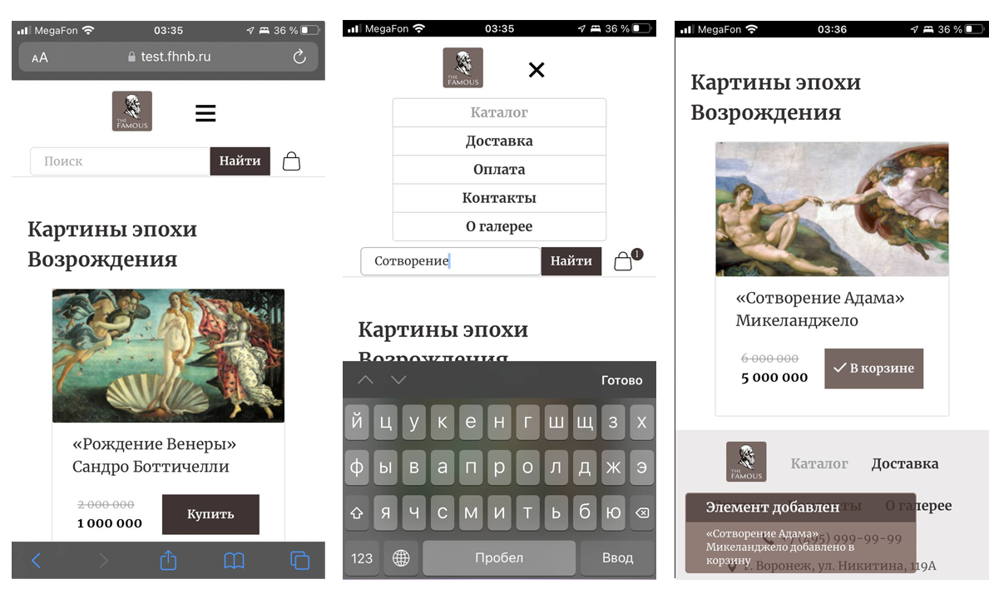
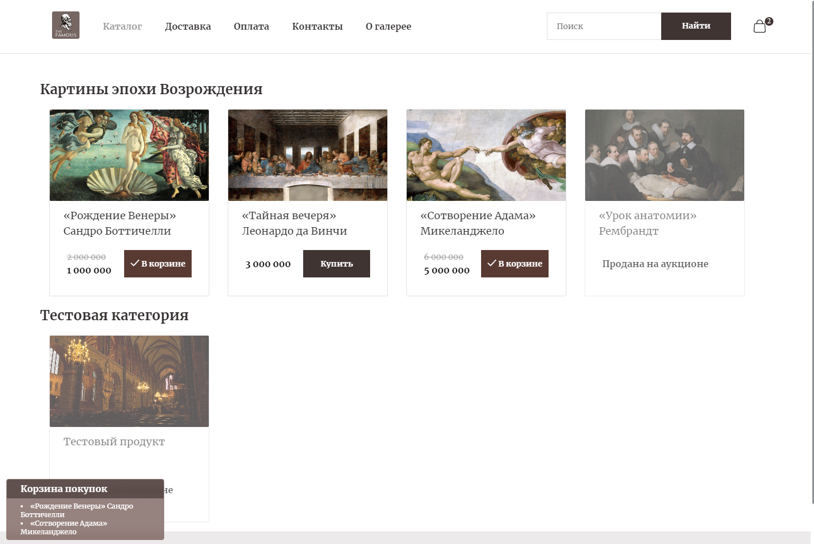

# The Famous store

[](https://vuejs.org/guide/)
[](https://cli.vuejs.org/)
[](https://router.vuejs.org/)
[](https://pinia.vuejs.org/)
[](https://github.com/kyvg/vue3-notification)

## Онлайн-витрина, верстка + vue

> [Test website with latest build](https://test.fhnb.ru/famous/)

| Image | Video |
|---|---|
|  | <video src="https://user-images.githubusercontent.com/1816594/239395068-7af782ef-9fdd-42c9-b9b1-2226ddf9c011.MP4"></video> |



[Figma with design](https://www.figma.com/file/vICMEmfQGTVqBeWJSyBnST/Untitled?node-id=0%3A1&t=Vzp9mrFa2x4R8sOD-0)

---
### 1. Preparing

  1. npm install
  2. npm run dev
  3. npm run build
  4. npm run lint

---
### 2. Features

  1. Fetch data from json.
  2. Add and remove items from cart.
  3. Alert notifications
  4. Saving cart in browser localStorage.
  5. Pinia Store & Routing
  6. Can be pinned on ios home screen (PWA)
  7. Search

---
### 3. data.json structure
```
{
  "Items": [
    {
      "id": 346,
      "category": 1,
      "title": "«Рождение Венеры» Сандро Боттичелли",
      "image": "//test.fhnb.ru/famous/img/item4.jpg",
      "price": "1 000 000",
      "discount": "2 000 000",
      "active": true
    },
    {
      "id": 753,
      "category": 1,
      "title": "«Тайная вечеря» Леонардо да Винчи",
      "image": "//test.fhnb.ru/famous/img/item2.jpg",
      "price": "3 000 000",
      "discount": "",
      "active": true
    },
    {
      "id": 145,
      "category": 1,
      "title": "«Сотворение Адама» Микеланджело",
      "image": "//test.fhnb.ru/famous/img/item3.jpg",
      "price": "5 000 000",
      "discount": "6 000 000",
      "active": true
    },
    {
      "id": 654,
      "category": 1,
      "title": "«Урок анатомии» Рембрандт",
      "image": "//test.fhnb.ru/famous/img/item1.jpg",
      "price": "2 000 000",
      "discount": "",
      "active": false
    },
    {
      "id": 377,
      "category": 2,
      "title": "Тестовый продукт",
      "image": "https://sun9-75.userapi.com/impg/c858024/v858024403/23004c/_QnuDfSq5EM.jpg?size=1280x853&quality=96&sign=f1ee670d77c7bf5e72db03e04f3e5a8b&type=album",
      "price": "10 000 000",
      "discount": "",
      "active": false
    }
  ],
  "Categories": [
    {
      "id": "1",
      "name": "Картины эпохи Возрождения"
    },
    {
      "id": "2",
      "name": "Тестовая категория"
    }
  ]
}
```
---

  [](https://fhnb.ru/)
